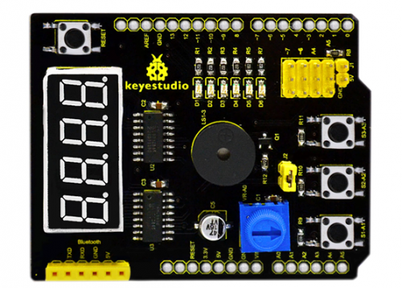
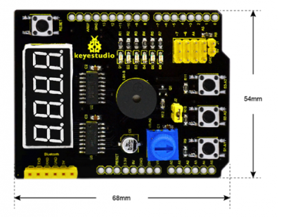
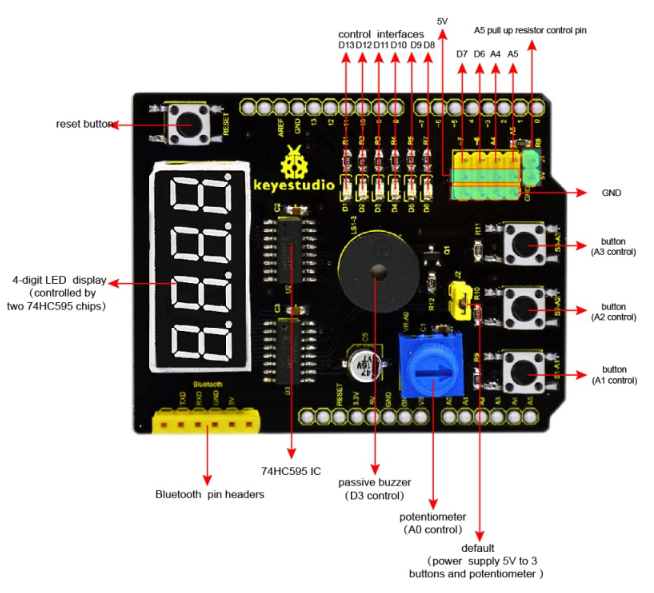
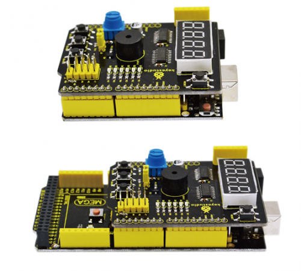
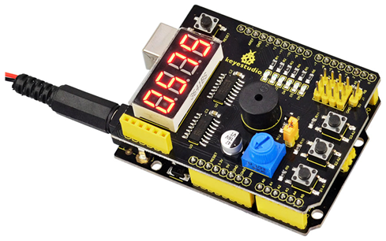

# KS0184 keyestudio Multi-purpose Shield V2



## 1. Introduction

Multi-purpose Shield V1 is a learning board based on Arduino. No need for soldering and connection.Download the program to complete experiment.

It is multi-purpose and we offer code libraries of all modules that have been tested. You can use them directly. There are extension ports on the shield to help you to complete other experiments.

## 2. Specification

- Compatible with main controllers such as UNO R3 and MEGA2560.
- Comes with 6 LED indicators to show the program status.
- Comes with 3 switching buttons
- Comes with a reset button
- Comes with a potentiometer for analog input
- Comes with a passive buzzer for alarm.
- Comes with a 4-digit LED display to show the number

## 3. Details

- Dimensions: 68mm*54mm*19mm
- Weight: 23g



## 4. Interface Instruction



## 5. Hookup Guide

Simply plug the shield into UNO R3 board or MEGA 2560.



## 6. Sample Code

Code download: [Resources](./Resources.7z)

```c
//pressing nothing to display value of analog revolving potentiometer
//pressing key1 to show 0-3 on LED Segment Displays
//pressing key2 and buzzer ringing
//pressing key3 and flowing light on

//defining three pins of 74HC595
int latchPin = 4;//ST_CP
int clockPin = 5;//SH_CP 
int dataPin = 2; //DS 

//defining three key input
int key1 = A1;
int key2 = A2;
int key3 = A3;

//buzzer pin
int buzzer = 3;

//pin definition of flowing light
int led1 = 13;
int led2 = 12;
int led3 = 11;
int led4 = 10;
int led5 = 9;
int led6 = 8;


int dat_wei[4]={0x01,0x02,0x04,0x08};    //LED Segment Displays
//showing 1--4
int dat_duan[10]={0xc0,0xf9,0xa4,0xb0,0x99,0x92,0x82,0xf8,0x80,0x90}; //LED Segment Displays showing 0--9
char i=0; 
void setup ()
{
  pinMode(latchPin,OUTPUT);
  pinMode(clockPin,OUTPUT);
  pinMode(dataPin,OUTPUT); 

  pinMode(key1,INPUT); 
  pinMode(key2,INPUT); 
  pinMode(key3,INPUT); 

  pinMode(buzzer,OUTPUT);

  pinMode(led1,OUTPUT);
  pinMode(led2,OUTPUT);
  pinMode(led3,OUTPUT); 
  pinMode(led4,OUTPUT);
  pinMode(led5,OUTPUT);
  pinMode(led6,OUTPUT); 
  for(char i=8;i<14;i++)
   digitalWrite(i,HIGH);    
}

void loop()
{
    if(digitalRead(key1)==LOW )
      SMG();                    //testing LED Segment Displays
    if(digitalRead(key2)==LOW )
      buzzer_();                //testing buzzer
    if(digitalRead(key3)==LOW)
      led_display();            //testing LED
    if(digitalRead(key1)==HIGH & digitalRead(key2)==HIGH & digitalRead(key3)==HIGH)  
      analog();                //testing analog input
}

void SMG(void)
{
 digitalWrite(latchPin,LOW);                         //clear LED Segment Displays
 shiftOut(dataPin, clockPin, MSBFIRST ,0x00);
 shiftOut(dataPin, clockPin, MSBFIRST ,0x00);
 digitalWrite(latchPin,HIGH);
 while(1)
 {
 	digitalWrite(latchPin,LOW);//MSBFIRST,transmitting binary bit from high to low,74HC595 starts from first piece, and displaces data from Q0 to Q7. If there is data, it will start from the second piece like this.
     shiftOut(dataPin, clockPin, MSBFIRST ,dat_duan[i]);   //data about second piece     
     shiftOut(dataPin, clockPin, MSBFIRST ,dat_wei[i]);    //way of MSBFIRST,data about first piece
     digitalWrite(latchPin,HIGH);
     i++;
     if(i==4){i=0;}
     if(digitalRead(key1)==HIGH)
     {
       digitalWrite(latchPin,LOW);                         //clear LED Segment Displays
       shiftOut(dataPin, clockPin, MSBFIRST ,0x00);
       shiftOut(dataPin, clockPin, MSBFIRST ,0x00);
       digitalWrite(latchPin,HIGH);
       break;
     }
  }
}

void buzzer_(void)
{
 char i;
 digitalWrite(latchPin,LOW);                         //clear LED Segment Displays
 shiftOut(dataPin, clockPin, MSBFIRST ,0x00);
 shiftOut(dataPin, clockPin, MSBFIRST ,0x00);
 digitalWrite(latchPin,HIGH);
 while(1)
 {
     for(i=0;i<80;i++)// output a frequency sound
     { 
      digitalWrite(buzzer,LOW);// sound
      delay(1);//delay1ms 
      digitalWrite(buzzer,HIGH);//not sound
      delay(1);//ms delay 
     } 
     for(i=0;i<100;i++)// output a frequency sound
     { 
      digitalWrite(buzzer,LOW);// sound
      digitalWrite(buzzer,HIGH);//not sound
      delay(2);//2ms delay 
     }
     if(digitalRead(key2)==HIGH)
     {
       digitalWrite(latchPin,LOW);                         //clear LED Segment Displays
       shiftOut(dataPin, clockPin, MSBFIRST ,0x00);
       shiftOut(dataPin, clockPin, MSBFIRST ,0x00);
       digitalWrite(latchPin,HIGH);
       break;
     }
 }
}

void led_display()
{
    digitalWrite(latchPin,LOW);                         //clear LED Segment Displays
    shiftOut(dataPin, clockPin, MSBFIRST ,0x00);
    shiftOut(dataPin, clockPin, MSBFIRST ,0x00);
    digitalWrite(latchPin,HIGH);
    while(1)
    {
     digitalWrite(led1,LOW);
     delay(100);
     digitalWrite(led1,HIGH);
     digitalWrite(led2,LOW);
     delay(100);
     digitalWrite(led2,HIGH);
     digitalWrite(led3,LOW);
     delay(100);
     digitalWrite(led3,HIGH);
     digitalWrite(led4,LOW);
     delay(100);
     digitalWrite(led4,HIGH);
     digitalWrite(led5,LOW);
     delay(100);
     digitalWrite(led5,HIGH);
     digitalWrite(led6,LOW);
     delay(100);
     digitalWrite(led6,HIGH);
     if(digitalRead(key3)==HIGH)
     {
       break;
     }
   }
}


void analog()
{
    int val,qian,bai,shi,ge;
    val=analogRead(A0);
    qian=val/1000;
    bai=val%1000;
    bai=bai/100;
    shi=val%100;
    shi=shi/10;
    ge=val%10;
    digitalWrite(latchPin,LOW);
    shiftOut(dataPin, clockPin, MSBFIRST ,dat_duan[qian]);
    shiftOut(dataPin, clockPin, MSBFIRST ,0x01);
    digitalWrite(latchPin,HIGH);
    digitalWrite(latchPin,LOW);
    shiftOut(dataPin, clockPin, MSBFIRST ,dat_duan[bai]);
    shiftOut(dataPin, clockPin, MSBFIRST ,0x02);
    digitalWrite(latchPin,HIGH);
    digitalWrite(latchPin,LOW);
    shiftOut(dataPin, clockPin, MSBFIRST ,dat_duan[shi]);
    shiftOut(dataPin, clockPin, MSBFIRST ,0x04);
    digitalWrite(latchPin,HIGH);
    digitalWrite(latchPin,LOW);
    shiftOut(dataPin, clockPin, MSBFIRST ,dat_duan[ge]);
    shiftOut(dataPin, clockPin, MSBFIRST ,0x08);
    digitalWrite(latchPin,HIGH);
}
```

## 7. Test Result

Done uploading the code to the board, power on the board, you should see the 4-digit LED display the number. Shown below.



The analog value output by potentiometer is showed on the 4-digit LED display.

Press the button S3-A3, the 6 SMD LEDs will light up one by one like the flowing light, but 4-digit LED display is off.

Press the button S2-A2, the passive buzzer will beep and 4-digit LED display is still off.

Press the button S1-A1, 4-digit LED display will show the default number 0123.